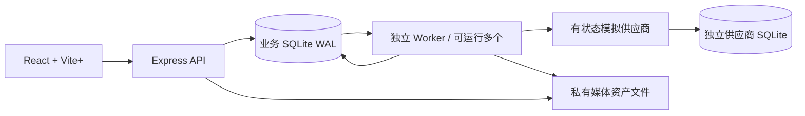
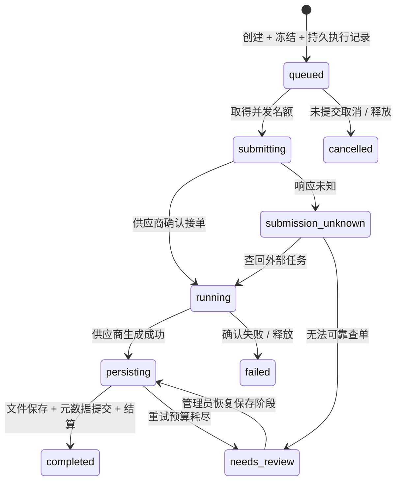

# 任务可靠性与账务设计

这个版本用于证明：第三方生成服务出现不确定结果时，网站仍能解释任务、保护账户余额并恢复执行。使用单机模块化架构，API 与 Worker 分进程；没有真实模型、支付或训练。

## 系统边界

业务数据库同时保存任务和执行记录，避免“创建任务成功但入队丢失”。这里的 `work` 是数据库任务表，承担持久队列职责；`creations` 才是已交付的作品，没有额外引入 Redis 或消息中间件。SQLite 与私有文件都位于同一台机器，不支持跨机器共享 SQLite 来扩容。

| 模块 | 职责 |
| --- | --- |
| `server/app.mjs` | HTTP 路由、登录权限、上传与响应编排 |
| `server/catalog-service.mjs` | 管理员模板增删改查/上下架、公开模板读模型、不可变版本、分页筛选 |
| `server/generation-service.mjs` | 规格报价、输入归属校验、幂等创建任务和快照 |
| `server/billing-service.mjs` | 同事务冻结、结算或释放积分及流水 |
| `server/collection-service.mjs` | 作品查询、删除、所有者校验及 Collection 读模型 |
| `server/asset-service.mjs` | 统一媒体资产、不可变写入、引用保留判断、可重试物理清理 |
| `server/database.mjs` | 全新 schema、事务与数据库约束；不迁移旧数据 |
| `server/engine.mjs` | 状态机、租约、并发控制、恢复与保存输出 |
| `server/provider.mjs` | 独立存储的供应商模拟器，支持故障注入；异步调用边界允许适配器返回 Promise |
| `server/worker.mjs` | 独立执行进程、心跳与故障后重新领取 |
| `src/CreateModal.tsx` | 唯一创作入口，图片槽位、报价与本地故障演示 |
| `src/AdminCatalogPage.tsx` | 模板发布、角色配置与发布草稿恢复 |
| `src/CatalogManager.tsx` | 列表筛选/分页、详情、完整版本编辑、不可恢复删除确认 |
| `src/recovery.ts` | 提交前保存请求标识，刷新后查回原任务 |

## 状态机及业务决定

其他分支：429 明确未接单时退回排队；查单、轮询等恢复超过重试预算时也进入待核查；在轮询仍返回 running、且距供应商确认接单已超过 3 分钟时进入人工核查，排队时间不计入。管理员可以恢复可核查任务的原阶段，不提供通用“强制再生成”按钮。

**未知不是失败。** 超时不能触发自动退款或重新生成。供应商可能已接单并发生费用。本演示的“无查单能力”场景会保留冻结积分、停止自动执行，并保守占用供应商名额；真实业务需要供应商账单/工单等证据后再做人工对账。本版本不实现无证据的手动结算或放款按钮。

供应商不支持可靠取消，因此只允许取消 `queued`。提交阶段、生成中和待核查任务都不能因为用户点击取消就释放积分。

## 账务不变量

以 300 积分账户、12 积分任务为例：

| 阶段 | 可用 | 冻结 | 流水可用变化 | 流水冻结变化 |
| --- | ---: | ---: | ---: | ---: |
| 初始 | 300 | 0 | +300 | 0 |
| 创建任务 | 288 | 12 | -12 | +12 |
| 保存作品并结算 | 288 | 0 | 0 | -12 |
| 或确认失败并释放 | 300 | 0 | +12 | -12 |

- 任务、冻结余额、冻结流水、执行记录在同一 `BEGIN IMMEDIATE` 事务内创建。
- 成功路径只有作品落盘之后才能结算。生成成功但下载失败时继续冻结。
- 条件更新 `billing_state='held'` 加上 `(job_id, kind)` 唯一约束，防止重复结算/释放。
- `可用余额 = SUM(ledger.amount)`；`冻结余额 = SUM(ledger.reserved_delta)`；冻结余额也等于该账户 held 任务费用之和。
- 供应商成本单独写入 `provider_costs`，每个外部任务唯一。失败时用户积分可以释放，但已发生的供应商成本仍保留。
- 模拟成本使用 `mock_units`，不是人民币、美元或真实供应商报价，不能据此声称毛利率。
- 任务保存模板版本、模型名、预设提示词和报价版本快照。前端通过报价接口显示金额并提交金额/价格版本。新任务必须提供有效的确认金额与价格版本，缺失或类型无效返回 400；与服务端重算报价不一致返回 409，要求重新确认。拒绝受理时不创建任务或冻结积分，实际费用始终由服务端决定。相同请求标识和业务参数命中已有任务时直接返回原任务，不重新校验当前报价，也不重复冻结。

## Worker 恢复与并发

Worker 先在短事务内领取任务并写入随机租约标识，事务结束后再调用适配器，不把数据库事务跨越外部调用。提交结果时再次核对租约标识和有效期。默认租约 5 秒，进程死亡后到期可被重新领取；提交中的任务恢复时先查单。

全局最多 2 个处于提交/生成中的任务；单用户最多 3 个未结束任务。名额判定与状态切换在数据库事务中完成，多 Worker 共用同一限制。429 设置全局新提交冷却；其他外部查询连续错误可暂停新提交 30 秒。失败阶段指数退避，默认累计 3 次错误进入人工核查。已经生成完成、正在保存文件的任务不占生成名额。

本模拟器同时提供业务单号唯一性和权威查单。**这不意味着任意供应商 API 都能保证只计费一次。** 接入真实供应商时必须核对幂等能力、业务单号查询的一致性以及请求在途时的语义。普通“暂未查到”不能当成“绝对未接单”；无法保证安全时必须保留未知状态。这里的恢复测试证明的是所实现协议下的行为。

## 媒体与账务的边界

输出流程为：适配器下载 → 基本类型/大小检查 → 登记 staging 资产和 job_outputs → 临时写入/fsync/rename → 同一事务将资产标记 ready、建立作品、完成任务和账务结算。

Collection 读模型合并有效作品与任务（包括失败/取消任务），最多返回 100 条卡片，未结束任务优先；计数分别来自全部未删除 creations 和全部未结束任务。因此超过 100 条时总计可能大于当前卡片数，尚无作品列表翻页。作品删除不修改任务终态。媒体统一位于 DATA_DIR/assets，只有受业务权限保护的入口可读取。作品封面使用视频预览，不绑定原输入图。

文件清理由 AssetService 负责。模板当前引用、未结束任务和有效作品保护文件；历史记录不永久占用文件。新上传但未被引用的文件过期后进入清理候选。清理先在事务中标记 deleting，再幂等删除文件，失败可重试。详见 [媒体生命周期](docs/media-lifecycle-design.md)。

输入图已验证和重编码，当前模拟器只接收图片字节数与摘要，不会拿本地登录态 URL 假装能被远程模型读取。真实接入需服务端上传文件到供应商，或使用限定对象、限定有效期的签名 URL。真实输出也需域名/重定向控制、流式大小限制、下载超时和完整媒体解析；当前本地模拟复制不等于已经实现这些公网下载防护。

## 可观察和可演示

每个任务都有业务时间线、外部调用阶段/结果、供应商任务 ID、价格和模板快照、模拟供应商成本及文件证据。后台显示 Worker 心跳、并发上限、待核查数量和新提交暂停状态。

后台重放按钮只针对完成任务注入 3 次重复成功和 1 次晚到 running 事件，验证状态不会回退、积分不会重复结算。这是带管理员权限和操作记录的内部事件演示，**不是已经接通公网 Webhook**。实际 Webhook 还需供应商验签、事件去重、关联校验和重放保护。

浏览器发送前把请求键和请求体保存在按用户隔离的 localStorage 中。网络结果不确定时保留记录；刷新后先查原任务，未找到则按原键重试。创建弹窗另有明确标注的“丢弃响应”演示开关。记录包含提示词，不含图片文件；同设备其他使用者可能读取浏览器存储，正式产品需按隐私要求调整保留策略。

## 数据基线与验证

默认使用 `.data-v2`，拒绝打开不兼容旧库，不写历史迁移。不删除旧 `.data`，但应用不再读取它。schema 使用明确状态约束、外键与唯一键。

`npm test` 使用独立临时目录，覆盖完整产品流程、媒体删除与引用、积分、跨用户权限、未知结果恢复和真实进程退出。`npm run build` 检查 TypeScript 并构建前端。

## 仍需在真实接入阶段完成

1. 确定模型和供应商协议，实现真实网络适配器、超时/取消、凭据管理、错误码映射与真实账单核对。网络请求必须有短于租约的超时，或实现租约续期；本模拟器的本地调用不验证真实网络延迟。
2. 按真实模型能力完善模板配置；当前支持完整模板增删改查与上下架；参考视频、槽位、Prompt 和输出规格变更创建新版本。尚未验证真实模型效果。
3. 接入私有对象存储、完整媒体解析/转码、上传总量限额和备份恢复；本地资产删除/保留与重试已实现。
4. 真实支付另行实现支付订单、签名回调、充值幂等、退款与账单对账。本版本只有演示积分。
5. 多租户限额、每日成本上限、公平调度、持续告警和实际负载测试。现有并发门控不是性能容量证明。
6. 上线前处理公开演示凭据、账户验证、密码找回、运行环境与用户内容规则；部署到多机时迁移数据库/队列/存储架构。

## 当前入口与边界

唯一动作模板创作入口是 CreateModal。旧用户模板创建、送审、审核、静态模板定义、旧任务视频入口、历史数据库迁移均已移出当前实现。模板删除和作品删除均无回收站或恢复。

完整决策见 [重构基线](docs/refactor-baseline.md)。图片/视频用途与公开范围是业务规则，模型效果、支付和生产规模不是这次 demo 重构的验收目标。
