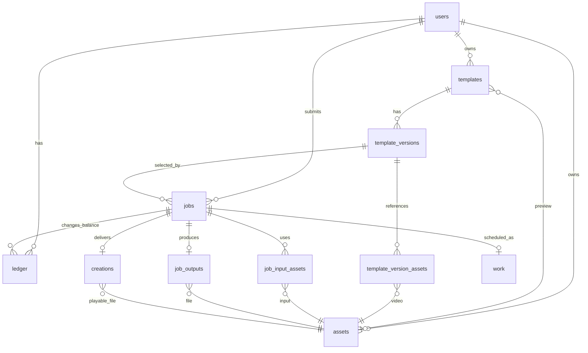

# 关键数据模型

本文对应当前 `server/database.mjs` 中的业务库 schema（`user_version = 102`）。业务数据保存在 `DATA_DIR/playbox.sqlite`，媒体字节保存在 `DATA_DIR/assets/`；模拟供应商另用 `DATA_DIR/provider.sqlite`。表中的时间戳是 Unix 毫秒，布尔值使用 SQLite 整数 `0/1`，配置和快照使用 JSON 文本。以下只列业务关键字段；完整列定义、非空约束和索引以 schema 为准。

## 对象关系

`templates.current_version_id` 指向当前配置，`jobs.template_version_id` 固定提交时的配置。图中的外键和历史关联只说明来源；文件是否继续保留，由当前模板、未结束任务和未删除作品的有效引用决定。

## 账户与会话

| 表 | 关键字段 | 含义与约束 |
| --- | --- | --- |
| `users` | `id`, `email`, `name`, `password`, `role`, `credits`, `reserved`, `created_at` | `email` 唯一；`role` 为 `admin/user`；`credits` 是可用积分，`reserved` 是冻结积分，均不可为负。`password` 存储带盐哈希。 |
| `sessions` | `token`, `user_id`, `expires_at` | `token` 是 Cookie 中随机令牌的 SHA-256 值；过期会话不被接受。 |

接口返回的 `User`（`src/types.ts`）只包含公开的账户字段，不返回密码或会话令牌。

## 模板与版本

| 表 | 关键字段 | 含义与约束 |
| --- | --- | --- |
| `templates` | `id`, `owner_id`, `title`, `description`, `category`, `tags`, `status`, `current_version_id`, `preview_asset_id`, `create_key`, `create_payload`, `created_at`, `updated_at`, `published_at` | 当前模板元信息；`tags` 是字符串数组 JSON。`status` 为 `public/private/deleted`；删除是状态标记。`(owner_id, create_key)` 唯一，保存规范化的 `create_payload` 用于幂等发布。`updated_at` 是编辑和删除时的并发校验值。 |
| `template_versions` | `id`, `template_id`, `version`, `input_schema`, `prompt_recipe`, `output_options`, `created_at` | 生成配置版本；`(template_id, version)` 唯一。参考视频、槽位、Prompt 或输出规格变化时插入新版本；旧版本不覆写。 |
| `template_version_assets` | `version_id`, `asset_id`, `position` | 某版本有序的动作参考视频；每版本的 `position` 和 `asset_id` 分别唯一。 |
| `favorites` | `user_id`, `template_id` | 用户收藏关系，复合主键防重复。 |

`input_schema` 对应前端 `InputSlot[]`：每个槽位有唯一 `key`、`person/scene` 类型、`label`、必填标记和可选 `referenceRole`。当前允许 1–4 个必填图片槽位。`output_options` 对应 `OutputOptions`：默认时长/分辨率、允许的时长与分辨率、是否允许用户输入 Prompt。当前取值是 4/8 秒与 720p/1080p 的子集。参考视频允许 1–3 段。

公开目录的 `Template` 是查询模型：组合模板当前版本、预览 URL、使用次数和当前用户的收藏状态。管理员的 `AdminTemplate` 额外带参考视频 ID、`promptRecipe` 和任务数。这些派生字段不作为 `templates` 的独立列保存。

## 素材与作品

| 表 | 关键字段 | 含义与约束 |
| --- | --- | --- |
| `assets` | `id`, `owner_id`, `kind`, `filename`, `mime`, `bytes`, `sha256`, `state`, `library`, `created_at`, `expires_at`, `deleted_at`, `cleanup_error` | 一个 ID 对应一份不可变文件；`kind` 为 `image/reference/preview/output`，`mime` 记录媒体类型（如 `image/jpeg`、`video/mp4`），`filename` 唯一。`state` 为 `staging/ready/deleting/deleted`；清理错误保留以便重试。当前所有新资产的 `library` 都写为 `0`，只有自动清理逻辑读取它：`1` 会使已就绪的资产不因到期而进入清理候选。当前没有将它设为 `1` 的业务入口。 |
| `job_input_assets` | `job_id`, `asset_id`, `slot_key`, `role` | 任务的固定输入。`role=image` 时 `slot_key` 是模板槽位 key；`role=reference` 时是从 `0` 开始的参考视频位置。`(job_id, role, slot_key)` 唯一。 |
| `job_outputs` | `job_id`, `asset_id` | 任务与已暂存输出资产的一对一来源记录；`asset_id` 唯一。它本身不表示作品已交付。 |
| `creations` | `id`, `job_id`, `user_id`, `asset_id`, `created_at`, `deleted_at` | 已交付作品；`job_id` 唯一，一个任务最多一件作品。`deleted_at` 非空表示作品已删除，禁止后续播放/下载；任务完成事实和账务保留。 |

新文件先登记为 `staging`，写入、同步并更名后转为 `ready`。上传素材通常在 24 小时后具备清理资格，但仍被有效业务对象引用时不会清理。读取权限由图片、模板预览、管理员参考视频或作品等具体业务入口判断，不能只凭 `assets` 行或文件名取得文件。详见[媒体生命周期](media-lifecycle-design.md)。

## 生成任务与执行记录

| 表 | 关键字段 | 含义与约束 |
| --- | --- | --- |
| `jobs` | `id`, `user_id`, `template_id`, `template_version_id`, `prompt`, `resolution`, `duration`, `cost`, `status`, `progress`, `error`, `request_key`, `created_at`, `accepted_at`, `completed_at`, `billing_state`, `scenario`, `provider_id`, `template_snapshot`, `quote_snapshot`, `input_assets_snapshot`, `retries`, `review_phase` | 一次生成请求的权威记录。`(user_id, request_key)` 唯一；模板版本、输入和报价在受理时固定。`provider_id` 是外部任务标识；`accepted_at` 是供应商接单时间，也是生成等待计时起点；`review_phase` 指出待核查阶段。schema 另有当前未写入的可空 `input_digest` 字段。 |
| `work` | `job_id`, `due_at`, `lease_token`, `lease_until` | 持久执行队列，每任务最多一条；Worker 使用到期时间和租约领取任务。进入终态或人工核查时删除队列项。 |
| `job_events` | `id`, `job_id`, `kind`, `message`, `created_at` | 面向业务的任务时间线。 |
| `provider_attempts` | `id`, `job_id`, `phase`, `outcome`, `detail`, `created_at` | 外部提交、查单、轮询或下载的尝试记录。 |
| `provider_costs` | `job_id`, `provider_id`, `cost_units`, `unit`, `created_at` | 模拟供应商成本；每任务和供应商任务 ID 唯一，默认单位 `mock_units`，与用户积分分开。 |
| `runtime` | `key`, `value` | Worker 心跳、新提交暂停时间和连续错误次数等共享运行状态。 |

任务执行状态 `status` 的主要路径是 `queued → submitting → running → persisting → completed`；提交结果不确定时进入 `submission_unknown`，无法自动判定时进入 `needs_review`。确认失败为 `failed`，只有尚在 `queued` 的任务可转为 `cancelled`。终态为 `completed/failed/cancelled`，不因晚到事件回退。

生成等待上限从 `accepted_at` 开始计算，排队时间不计入。旧数据库升级时根据接单或查单恢复事件回填；缺少接单事件的旧记录继续使用 `created_at` 作为保守兜底。

`billing_state` 独立于执行状态：`held` 表示费用仍冻结，`settled` 表示作品交付后已结算，`released` 表示确认失败或排队取消后已释放。`needs_review` 保持 `held`。`template_snapshot` 保存提交时的完整模板读模型与模拟模型配置；`quote_snapshot` 保存价格版本、积分、规格和结算规则；`input_assets_snapshot` 保存槽位到素材 ID 的映射。它们用于追溯，文件保留仍依据结构化关联。

模拟供应商的 `provider.sqlite` 独立于业务事务：`tasks` 以唯一 `business_key`（业务任务 ID）记录外部接单和完成时间，`faults` 记录一次性故障注入。这样可以演示“供应商已接单、业务进程却未收到响应”的恢复场景；它不是业务库的外键关系或真实供应商账单。

## 积分流水与核心不变量

| 表 | 关键字段 | 含义与约束 |
| --- | --- | --- |
| `ledger` | `id`, `user_id`, `job_id`, `kind`, `amount`, `reserved_delta`, `description`, `created_at` | 账户变动流水；`(job_id, kind)` 唯一，防止同一任务重复冻结、结算或释放。初始 `welcome` 流水没有任务 ID。 |

对费用为 `C` 的任务：受理时 `credits -= C`、`reserved += C`，写入 `hold(-C, +C)`；作品交付时 `reserved -= C`，写入 `settle(0, -C)`；确认失败或排队取消时 `credits += C`、`reserved -= C`，写入 `release(+C, -C)`。任务、输入关联、冻结和 `work` 入队在同一事务内完成；作品建立、任务完成和结算也在同一事务内完成。正常数据下，`users.credits = SUM(ledger.amount)`，`users.reserved = SUM(ledger.reserved_delta)`，并等于该用户仍处于 `held` 的任务费用合计。

## 与前端类型的边界

`src/types.ts` 定义的是 API 响应形状，并非数据库表的逐列映射。`Job` 中的 `template`、`quote`、`input_assets` 由任务 JSON 快照解析，`output_url`、`creation_id` 和 `creation_deleted` 由作品关系计算；`Template` 的 `favorite`、`uses`、`preview_url` 也由查询和关联计算。修改持久字段或快照格式时，应同步检查服务端序列化和这些前端类型。

代码入口：[数据库结构](../server/database.mjs)、[模板服务](../server/catalog-service.mjs)、[生成服务](../server/generation-service.mjs)、[账务服务](../server/billing-service.mjs)、[前端类型](../src/types.ts)。
