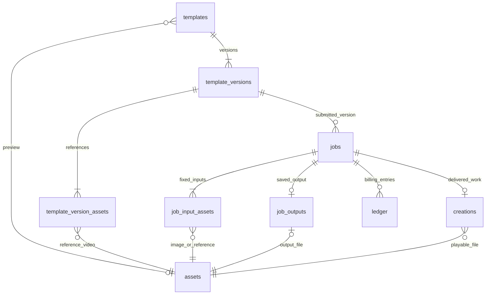

# Demo 重构基线

2026-09-24。范围：管理员维护动作模板；用户选模板、上传图片、报价生成、查看/删除作品；演示积分与可靠执行。暂不做训练、用户模板投稿、审核、支付、订阅、创作者分成、真实模型效果。

## 开发初期固定的规则

1. 一个媒体 ID 对应不可变字节；统一 assets，所有业务文件都在私有 assets 目录。
2. 模板只保存元信息/当前版本/预览。版本保存槽位、prompt、规格，结构化关联保存有序参考视频。更新配置新建版本；标题和预览可修改。
3. 模板 public/private/deleted；下架停止公开使用。删除不可恢复，保留模板记录、发布请求、版本和关联证据，不裁剪为最小记录。旧版本无回滚承诺；旧版本本身不保护文件，但素材库或活动任务等有效保留根仍会保护同一资产。
4. 任务只使用提交时的版本和输入。提交、引用绑定、积分冻结、入队为同一事务；外部调用不跨数据库事务。
5. 供应商结果未知不算失败，不盲目重提或退款。只有排队可取消；结果保存成功才结算。继续使用已有可观测状态机与租约。
6. 作品是已交付结果，不等于完成任务。作品删除不可恢复，不改变任务成功状态和账务。两个概念分别查询、分别计数。
7. 引用决定保留，入口决定授权。广场预览公开不等于参考视频/上传图片公开。管理员任务查看不自动获取用户作品访问权。
8. 删除作品立即撤销访问，文件清理可重试。后台只删除无有效引用、无活动执行占用的资产；数据库记录与物理文件不是同一事务。
9. 预览仅使用独立上传的预览资产，本轮不提供从作品选预览。移除旧的间接复用链路，未来扩展需显式引用与授权。
10. 视频上传可复用于多个模板，素材库保留到显式删除；被当前模板/活动任务占用则不可删除。图片为临时上传，上传 24 小时后由 Worker 按占用情况清理；未清理且仍为 ready 时可绑定任务。作品封面不再依赖用户输入图。
11. 资产清理状态 ready -> deleting -> deleted。新增绑定只允许 ready，在事务中校验。删除标记只为幂等/追溯，不是回收站。
12. 记录来源/参数的历史关联不永久保留文件。未结束任务、有效作品、当前模板和素材库是保留根。
13. 新开发基线使用 .data-v2。旧 .data 不迁移、不清空、不读取；若显式指定旧库则启动报错，避免静默改写。
14. 保持单机模块化架构：React/Vite+、Express、SQLite、独立 Worker、本地私有文件；不为 demo 引入微服务/Redis/对象存储。
15. 验收覆盖完整产品闭环、权限、事务不变量、共享文件、删除/清理恢复、并发引用、任务故障恢复。旧兼容测试移除，业务不变量测试改用真实模板和素材。现有测试覆盖多 Worker 名额/租约及事务引用规则；没有独立进程同时绑定与清理同一资产的压力测试。

## 服务分工

- Catalog：模板目录、发布编辑删除、版本绑定。
- Assets：文件身份、存储、归属/用途校验、引用占用查询、删除与清理。
- Generation：报价、输入校验、幂等提交、任务快照与引用。
- Engine：队列/租约、模型适配、未知结果核查、保存与恢复。
- Billing：冻结、结算、释放，余额与流水一致。
- Collection：已交付作品、删除、受控播放。
- HTTP：身份、请求解析、调用服务；不承担第二套业务状态机。

## 暂不承诺

无真实模型效果保证；目前只接入模拟供应商。无跨用户文件去重、视频转码/CDN、永久备份删除、历史版本回滚、媒体生产级解析和生产容量保证。删除无法回收已下载副本。后续真实模型接入仍需远端上传/签名 URL、安全下载、超时与租约续期。

## 核心对象关系

图中关系表达身份与历史关联；是否继续保留字节由生命周期规则判断，不能仅凭外键仍存在就永久保留文件。模板 current_version_id 指向当前配置，任务 template_version_id 固定提交时配置。一个任务最多交付一件作品，作品删除不会删除任务或账务。

## 本轮交付验证（2026-09-24）

- 最终 `npm test`：38 项通过，0 失败。包含管理员发布到普通用户生成/查看/删除的 HTTP 闭环、跨用户权限、媒体共享与清理失败、数据库基线拒绝、进程退出恢复和账务幂等。
- 最终 `npm run build`：TypeScript 检查与 Vite+ 生产构建通过。
- 浏览器手动走通登录、选择模板、上传项目内示例图片、提交生成、等待完成、作品展示与播放入口；查看删除确认后取消。不可恢复删除的实际行为由临时数据库上的自动化测试验证。
- 本机生成过程中发现旧运行环境没有为新数据目录提供有效 Worker 心跳；已启动使用新目录的 Worker，任务完成。以后使用 `npm run dev` 同时启动 API、Worker 与前端。
- 原代码和测试备份于 `/tmp/autogen-before-test-refactor-20260924.tar.gz`；移出的旧源码/测试保存在 `/tmp/autogen-legacy-source-20260924/`。这些是临时归档，不参与当前运行与构建。
- 默认运行新数据集 `.data-v2`；旧数据留在 `.data`，不会出现在当前界面。生成结果仍为模拟样片，不代表模型效果或真实远端 API 已接通。
